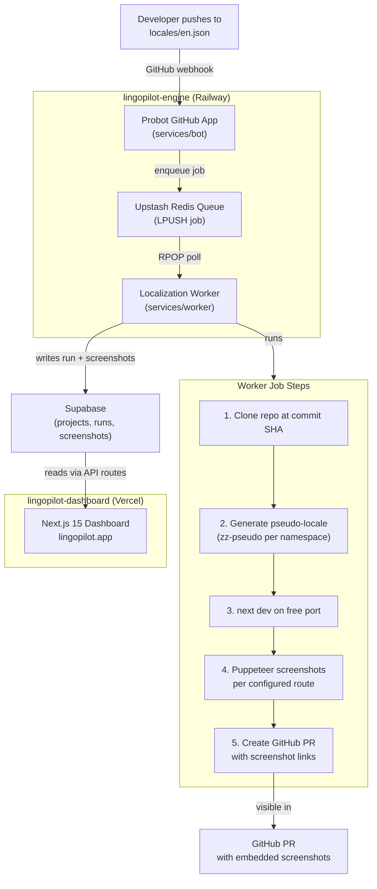

# LingoPilot — Job Readiness Analysis

**Last updated:** April 22, 2026  
**Repos:** [`lingopilot-dashboard`](https://github.com/heyitschien/lingopilot-dashboard) · [`lingopilot-engine`](https://github.com/heyitschien/lingopilot-phrase0)  
**Live product:** [lingopilot.app](https://www.lingopilot.app)  
**Analysis method:** Static code analysis + live system verification  
**Current maturity:** Tier 2 (Credible) → **Target: Tier 3 (Industry Standard)**

---

## System Status as of April 22, 2026

The full end-to-end pipeline is **live and verified**. This is the baseline for all documentation and portfolio work going forward.

| Component | Technology | Deployment | Status |
|---|---|---|---|
| Dashboard (frontend) | Next.js 15 + TypeScript + shadcn/ui + Supabase | Vercel → `lingopilot.app` | ✅ Live |
| Bot (GitHub App) | Probot + TypeScript + Upstash Redis | Railway | ✅ Live |
| Worker (job processor) | Node.js + TypeScript + Puppeteer + Octokit | Railway | ✅ Live |
| Queue | Upstash Redis (LPUSH / RPOP) | Upstash cloud | ✅ Verified |
| Database | Supabase (projects, runs, screenshots, github_installations) | Supabase cloud | ✅ Live, RLS enabled |

### Verified E2E Run — April 22, 2026

| Step | Result |
|---|---|
| Push to `public/locales/en/home.json` on `heyitschien/next-i18next-sample` | ✅ |
| Bot receives GitHub `push` webhook on Railway | ✅ |
| Bot enqueues job to Upstash Redis | ✅ |
| Worker dequeues and clones repo at commit SHA | ✅ |
| M4 internal pseudo-generation (5 namespaces → `zz-pseudo`) | ✅ |
| `next dev` server starts on free port (avoids OOM) | ✅ |
| Puppeteer screenshots `/`, `/checkout`, `/products` in `zz-pseudo` locale | ✅ |
| Worker pushes branch `lingo/pseudo-update-f11060c` to GitHub | ✅ |
| Worker opens PR #1 on `heyitschien/next-i18next-sample` | ✅ |
| Supabase run record updated to `succeeded` | ✅ |
| Dashboard shows run, PR link, and status | ✅ |

---

## What LingoPilot Is — The Story to Tell

LingoPilot is an **autonomous localization QA workflow system** — not AI translation.

When an engineer pushes a change to English copy in a Next.js app, the system automatically:
1. Receives a GitHub push webhook (GitHub App, Probot)
2. Validates and deduplicates the event via Upstash Redis
3. Enqueues a localization job
4. Worker picks up the job, clones the repo at the exact commit SHA
5. Generates a pseudo-localized version of all changed locale namespaces (`zz-pseudo`)
6. Starts a `next dev` server on a free port
7. Takes Puppeteer screenshots of every configured route
8. Opens a GitHub PR with embedded screenshot links for visual review
9. Writes the run result and PR number back to Supabase
10. Dashboard updates with run status

### Framing Guide

| What It Does | Correct Framing | Never Say |
|---|---|---|
| Deterministic text transformation rules | "Autonomous localization QA workflow" | "AI translation" |
| GitHub App + queue + worker pipeline | "Agentic workflow automation" | "AI agent" |
| Puppeteer screenshot comparison | "Visual regression pipeline" | "AI visual testing" |

### Resume Bullet

> Built LingoPilot: a 3-service agentic workflow system (GitHub App + async worker + Next.js dashboard) that automates localization screenshot QA via push-triggered PRs — deployed on Vercel + Railway, backed by Supabase + Upstash Redis

### GitHub Description (1 line)

> Autonomous localization QA pipeline — GitHub App + queue-based worker + Next.js 15 dashboard. Push English copy, get a visual PR.

---

## What Was Completed to Reach E2E (Work Log Summary)

Six fixes were required to go from "code exists" to "system runs":

1. **Bot file-watch pattern** — Extended `changedEnJson()` to match `public/locales/en/` files in addition to flat `locales/en.json`, enabling support for `next-i18next` style repos.
2. **Worker OOM fix** — Switched from `next build` (OOM on Railway's memory ceiling) to `next dev` by default. Pages compile on-demand; memory footprint reduced from ~2 GB to ~400 MB peak.
3. **Internal pseudo-generator** — Enabled `WORKER_INTERNAL_RUNNER=1` on Railway. Worker has a built-in M4 multi-namespace pseudo-generator; no external `npm run pseudo` script required.
4. **Puppeteer system deps** — Updated `nixpacks.toml` with Ubuntu 24.04 Noble `t64`-suffixed package names for Chromium system libraries (`libasound2t64`, `libatk1.0-0t64`, etc.).
5. **Demo repo cleanup** — Cleaned up `next-i18next-sample`: added `.lingopilot.yml` `i18n:` config block, added `zz-pseudo` to `next.config.mjs` locales, removed incomplete `ar` locale, rewrote README.
6. **GitHub App URL backfill** — Updated GitHub App Homepage URL and Setup URL from dead ngrok addresses to `https://www.lingopilot.app`. Manually inserted `github_installations` row (installation `126299118`) so dashboard shows repos.

Full details: `lingopilot-engine/docs/phase-2-mvp-v2/work-logs/2026-04-22-railway-e2e-runbook.md`

---

## Current Gap Analysis

All critical security and deployment blockers are resolved. Remaining gaps are documentation and polish only.

### Dashboard (`lingopilot-dashboard`)

| Priority | Finding | Status |
|---|---|---|
| High | README says "Next.js 14" — package.json has 15.2.4 | ❌ Open |
| High | README missing: demo GIF, problem statement, architecture diagram, AI dev notes, roadmap, tech stack rationale | ❌ Open |
| High | README header still says "Automatically synced with v0.app" — template artifact | ❌ Open |
| High | No GitHub Actions CI workflow → no green badge | ❌ Open |
| Medium | `env.local.example` should be named `.env.example` | ❌ Open |
| Medium | Missing `.cursorrules` file | ❌ Open |
| Medium | Missing `AGENTS.md` | ❌ Open |
| Medium | Missing `LICENSE` file | ❌ Open |
| Low | Runs table has no live auto-refresh — requires manual page reload | ❌ Open (easy fix) |
| Low | `lib/database.ts` has mock data stubs — not labeled clearly | ❌ Open |

### Engine (`lingopilot-engine`)

| Priority | Finding | Status |
|---|---|---|
| High | README missing: live demo URL, demo GIF, architecture diagram, AI dev notes, deploy badges, tech stack | ❌ Open |
| High | `superabase/` folder should be named `supabase/` — visible in GitHub file tree | ❌ Open |
| Medium | No `.env.example` at root or in `services/bot` / `services/worker` | ❌ Open |
| Medium | Missing `.cursorrules` | ❌ Open |
| Medium | `AGENTS.md` exists but may need updating | ⚠️ Review |
| Low | `services/bot` installation handlers are console-log stubs | ❌ Open |

### Both Repos

| Item | Status |
|---|---|
| Repos are private — not yet pinned to GitHub profile | ❌ Not public |
| No demo GIF recorded | ❌ Not recorded |
| Architecture diagram (Mermaid) not in either README | ❌ Open |

---

## Recommended Execution Order (High → Low Leverage)

These are ordered by recruiter impact, not effort.

| Order | Work Item | Why It's High Leverage | Estimated Time |
|---|---|---|---|
| 1 | **Record demo GIF/video** | Only thing that cannot be faked — proof the system runs live | 30 min |
| 2 | **Dashboard README rewrite** (12 sections) | First thing every recruiter reads — fixes Next.js 14 error, adds value prop, diagram, AI notes | 90 min |
| 3 | **Engine README rewrite** (12 sections) | Explains the backend, adds deploy badges, cross-links dashboard | 60 min |
| 4 | **Make repos public + pin dashboard** | Zero effort; unlocks recruiter discovery and GitHub profile impact | 5 min |
| 5 | **GitHub Actions CI** (lint + type-check) | Green badge = instant credibility; catches regressions | 20 min |
| 6 | **`.cursorrules` + `AGENTS.md`** in both repos | 2026 AI-native hiring signal | 15 min |
| 7 | **Rename `superabase` → `supabase`** | Visible folder name typo in GitHub file tree | 5 min |
| 8 | **Rename `env.local.example` → `.env.example`** in dashboard | Convention compliance | 5 min |
| 9 | **`LICENSE` files** (MIT) in both repos | Expected for any public repo | 5 min |
| 10 | **Live run auto-refresh** on dashboard | UX polish; makes demo more impressive | 20 min |

---

## Repository Maturity Target

| Tier | Label | Current State | Gap |
|---|---|---|---|
| Tier 1 | Passing | ✅ Already cleared | — |
| Tier 2 | Credible | ✅ Already cleared (live system, working demo) | — |
| **Tier 3** | **Industry Standard** | ❌ Not yet | READMEs + diagram + GIF + CI badge + AI notes + public |
| Tier 4 | Exceptional | ❌ Future | Blog post, metrics, Show HN |

**Tier 3 can be reached in one focused half-day sprint.**

---

## Architecture — System Diagram (Mermaid)

*Copy this into both READMEs under a "System Architecture" section.*



---

## Portfolio Framing — Talking Points

**What it demonstrates to a hiring manager:**
- Full-stack ownership: shipped every layer (Next.js frontend, Probot GitHub App, background worker, queue, database)
- Agentic workflow architecture: event-driven, queue-based, multi-step automation — the 2026 hiring signal
- Operational maturity: deployed on Railway + Vercel, real webhooks, real Puppeteer, real PRs
- Product thinking: a real workflow problem (localization review) with a real automated solution

**What it is NOT:** a tutorial clone, a CRUD app, or an AI chatbot wrapper.

---

## AI-Assisted Development Notes Template

*Add this section to both READMEs.*

```markdown
## How This Was Built

Developed using Cursor as the primary IDE with Claude Sonnet as a pair programmer for code generation,
architecture review, and debugging. All architectural decisions, feature design, deployment configuration,
and final implementation were made and verified by me. AI tooling was used to accelerate velocity, not
replace engineering judgment.

**Tools:** Cursor, Claude Sonnet, MCP tools (Supabase, Railway, Upstash)
**My role:** Architect, product decision-maker, reviewer, and shipping engineer
```

---

## Next Steps Checklist

- [ ] Record demo GIF (see demo recording guide)
- [ ] Rewrite dashboard README (12 sections, correct Next.js version, add GIF)
- [ ] Rewrite engine README (12 sections, add Railway deploy badges)
- [ ] Add GitHub Actions CI to dashboard (lint + type-check)
- [ ] Add `.cursorrules` to both repos
- [ ] Review/update `AGENTS.md` in engine; add to dashboard
- [ ] Add `LICENSE` (MIT) to both repos
- [ ] Rename `superabase/` → `supabase/` in engine
- [ ] Rename `env.local.example` → `.env.example` in dashboard
- [ ] Make both repos public
- [ ] Pin `lingopilot-dashboard` to GitHub profile with topics: `nextjs typescript supabase upstash github-app probot localization automation`
- [ ] Add live run auto-refresh to dashboard (10s polling interval)

---

*Reference documents: [`industry-standard-repository-framework.md`](../standards/industry-standard-repository-framework.md) · [`lingopilot-recruiter-readiness-report.md`](../standards/lingopilot-recruiter-readiness-report.md)*
