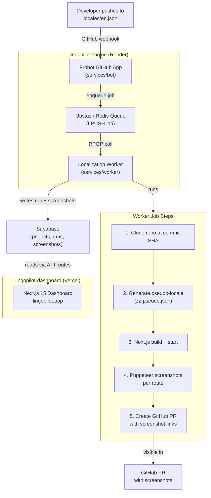

# LingoPilot — Recruiter Readiness Report

**Repos audited:** `lingopilot-dashboard` (381 files) · `lingopilot-engine` (239 files)  
**Date:** April 2026  
**Method:** Static analysis — file reads, dependency inspection, CI audit, README assessment  
**Current maturity:** Tier 1 (fails on credentials) → **Target: Tier 3 (Industry Standard)**  
**Estimated time to portfolio-ready:** 3 weeks

---

> **BLOCKER — Security must be resolved before any other work.**
>
> Confirmed live credentials in tracked files across both repos: GitHub App RSA private key (full PEM), Supabase service role JWT, Gmail app password, Neon DATABASE_URL. Neither repo can be made public, pinned to a GitHub profile, or shared with any recruiter until all credentials are rotated and git history is purged with BFG Repo-Cleaner.

---

## What LingoPilot Is — The Story to Tell

LingoPilot is an **autonomous localization QA workflow system** — not "AI translation."

When an engineer pushes a change to English copy in a Next.js app, the system automatically:

1. Receives a GitHub push webhook
2. Validates and deduplicates the event via Upstash
3. Enqueues a localization job to Redis
4. Worker picks up the job, clones the repo at the exact commit SHA
5. Generates a pseudo-localized version of changed strings (`zz-pseudo.json`)
6. Builds the Next.js app and starts a local server
7. Takes Puppeteer screenshots of every configured route
8. Opens a GitHub PR with embedded screenshot links for visual review

The dashboard (Next.js 15, Supabase, shadcn/ui) provides project management, run history, and a screenshot gallery UI.

### System Components

| Component | Technology | Deployment Target | Current Status |
|---|---|---|---|
| Dashboard (frontend) | Next.js 15 + TypeScript + shadcn/ui + Supabase + Upstash | Vercel — live at `lingopilot.app` | Deployed |
| Bot (GitHub App) | Probot + TypeScript + Upstash Redis | Render or Railway (Node service) | **Not deployed** |
| Worker (job processor) | Node + TypeScript + Puppeteer + Octokit + Supabase | Render or Railway (Node service) | **Not deployed** |
| Database | Supabase (projects, runs, screenshots tables) | Supabase cloud | Schema exists; RLS disabled |
| Queue | Upstash Redis (LPUSH / RPOP) | Upstash cloud | Configured; not verified live |

---

## Monorepo vs Separate Repos — Decision

**Recommendation: Keep them separate.**

### Why separate repos win

The bot and worker are Node services — they cannot be deployed to Vercel. The dashboard is a Next.js app on Vercel. These are genuinely different deployment targets. Forcing them into a monorepo adds pnpm workspaces / Turborepo complexity without solving a real problem.

Separate repos are actually a stronger portfolio signal: it shows you understand system boundaries, service decomposition, and that you chose the right deployment target for each component — not that you jammed everything into one repo for aesthetics.

**What to do instead:** Create a single landing architecture diagram in both READMEs showing how the four components connect. Link each repo to the other prominently. This gives recruiters the full picture while preserving clean deployment separation.

### When a monorepo would make sense

If you want to share TypeScript types between dashboard and engine (e.g. the `Job` type, `Run` type, `Screenshot` type), a monorepo with a shared `packages/types` workspace is a legitimate architectural upgrade. That is a Phase 2 enhancement — not a prerequisite for recruiter readiness. It adds 1–2 days of refactoring with no visible user-facing impact.

---

## Gap Analysis — Dashboard (`lingopilot-dashboard`)

### Critical

| Finding | Fix Required |
|---|---|
| Confirmed live credentials in tracked files (RSA key, Supabase JWT, Gmail password) | Rotate all + BFG purge git history before making public |

### High Priority

| Finding | Fix Required |
|---|---|
| `GETRender` / `POSTRender` in `app/api/runs/route.ts` (lines 75–141) are non-Next.js placeholder functions — not real route handlers | Delete these functions; implement real `GET` / `POST` route handlers |
| `app/api/runs/route.ts` tries to insert `user_id` into the `runs` table, but the SQL migration has no `user_id` column on `runs` | Either add `user_id` to migration or remove from insert — decide architecture first |
| `next.config.mjs` has `ignoreBuildErrors: true` and `eslint.ignoreDuringBuilds: true` — build never fails even on errors | Remove both ignores; fix resulting TypeScript and lint errors (many `:any` instances throughout) |
| README states "Next.js 14" but `package.json` has `next` **15.2.4** | Correct README to Next.js 15; update entire tech stack section with rationale |
| Missing README sections: demo GIF/screenshot, problem statement, architecture diagram, AI dev notes, roadmap, test strategy | Write all 6 missing sections; move demo URL above the fold |
| `lib/github.ts` is almost entirely stubs with TODOs (lines 25–88) — GitHub repo search and PR listing not implemented | Implement or clearly mark as planned in README roadmap |

### Medium Priority

| Finding | Fix Required |
|---|---|
| No `.github/workflows/` — zero automated checks on push/PR | Add basic CI: type-check + lint on push to `main` |
| Env example file is named `env.local.example` — industry convention is `.env.example` (dot-prefixed) | Rename to `.env.example`; link it explicitly in README |
| Missing `.cursorrules` file | Add `.cursorrules` with project-specific AI conventions |
| README header still says "Automatically synced with v0.app" — looks like scaffolded template, not authored work | Replace with project-owned header and value proposition |

### Low Priority

| Finding | Fix Required |
|---|---|
| `lib/database.ts` has extensive mock data and TODOs for many settings (billing, API keys, org) | Add clear "Mock vs Backend Mode" callout in README so recruiter understands the two modes |

---

## Gap Analysis — Engine (`lingopilot-engine`)

### Critical

| Finding | Fix Required |
|---|---|
| Same credential exposure as dashboard | Rotate all + BFG purge (same pass as dashboard) |

### High Priority

| Finding | Fix Required |
|---|---|
| Bot and worker are **not deployed** — no `Dockerfile`, no `render.yaml`, no `railway.toml`, no deploy badge anywhere | Deploy bot + worker to Render or Railway; add deploy badge to README |
| README references `.github/workflows/lingo-pilot.yml` but actual file is `phase-0.yml` — broken documentation | Fix workflow filename in README; rename file or update reference |
| Missing README sections: live demo URL, demo GIF, architecture diagram, `.env.example` reference, known limitations, AI dev notes, tech stack rationale | Full README rewrite per 12-section standard |
| SQL migration has no `user_id` on `runs` table; dashboard code tries to insert it — inconsistent contract between repos | Align schema with dashboard expectations; add migration for `user_id` if needed |
| `supabase-init-2025-08-19.sql` lines 59–60: RLS disabled on all tables — risk is high if service role key is ever exposed | Document this architectural decision explicitly; consider enabling RLS with service role bypass policy |

### Medium Priority

| Finding | Fix Required |
|---|---|
| `phase-0.yml`: `start_server` step does not set `server_pid` in `$GITHUB_OUTPUT` format — "Stop server" step may not kill the right PID | Fix PID capture and kill logic in `phase-0.yml` |
| Root Next.js demo app uses `.jsx`, not TypeScript — inconsistent with `services/bot` and `services/worker` which are TypeScript | Migrate root app to TypeScript or document it clearly as a Phase-0 demo only |
| No `.env.example` at root or in `services/bot` or `services/worker` — recruiter cannot run the project | Add `.env.example` to root and each service with all variables described |

### Low Priority

| Finding | Fix Required |
|---|---|
| `services/bot/src/index.ts` installation handlers are `console.log`-only stubs with TODO for dashboard sync (lines 139–175) | Implement or move to roadmap; remove logging-only stubs |
| SQL migrations live in a folder called `superabase` instead of `supabase` | Rename folder — this is visible in the GitHub file tree to recruiters |

---

## End-to-End Completion Status

The core loop is theoretically complete in code. These are the gaps between "code exists" and "system actually runs."

| Step in Core Loop | Code Status | Infrastructure Status | Blocker |
|---|---|---|---|
| 1. Push change to `locales/en.json` | GitHub Action (`phase-0.yml`) exists | Works for demo repo only | None for demo; needs GitHub App install for real repos |
| 2. Bot receives GitHub push webhook | `services/bot/src/index.ts` fully implemented | **NOT deployed** — bot has no public URL | Deploy bot to Render/Railway; register URL in GitHub App settings |
| 3. Bot enqueues job to Upstash | `services/bot/src/upstash.ts` + LPUSH logic complete | Upstash configured; needs fresh credentials after rotation | Rotate + re-configure credentials |
| 4. Worker picks up job | `services/worker/src/jobs/localization.ts` implemented | **NOT deployed** — no persistent RPOP process running | Deploy worker as long-running Node service |
| 5. Worker writes to Supabase | `services/worker/src/lib/supabase.ts` complete | Schema deployed; RLS disabled; `user_id` mismatch | Fix schema inconsistency; verify service role key after rotation |
| 6. Worker opens GitHub PR | `@octokit/rest` + screenshot URL logic in `localization.ts` | Needs GitHub App installed on target repo | Install GitHub App on demo repo; verify PR creation |
| 7. Dashboard shows run | API routes + Supabase reads implemented | Dashboard live at `lingopilot.app` | Needs one real end-to-end run to populate data |
| 8. Dashboard shows screenshot gallery | `components/screenshot-gallery.tsx` exists | Depends on step 5 writing screenshot URLs correctly | Depends on steps 5–6 completing |

---

## Phased Execution Plan

### Phase 0 — Security (Days 1–2) — Absolute Blocker

- [ ] Rotate GitHub App RSA private key — generate new key pair in GitHub App settings
- [ ] Rotate Supabase service role JWT — regenerate in Supabase project settings
- [ ] Rotate Gmail app password — revoke in Google account security
- [ ] Rotate Neon DATABASE_URL — reset connection string in Neon console
- [ ] Run BFG Repo-Cleaner on both repos to purge `.env` files from git history
- [ ] Force push cleaned history to remote (keep repos private during this step)
- [ ] Verify with `git log --all --full-history -- .env` that no env files remain in history

### Phase 1 — Fix Breaking Code Issues (Days 3–5)

- [ ] Remove `GETRender` / `POSTRender` dead code from `app/api/runs/route.ts`
- [ ] Implement real `GET /api/runs` and `POST /api/runs` as proper Next.js route handlers
- [ ] Align `runs` table schema: add `user_id` column to SQL migration OR remove it from the dashboard insert
- [ ] Remove `ignoreBuildErrors` and `eslint.ignoreDuringBuilds` from `next.config.mjs`
- [ ] Fix TypeScript `:any` instances in `api/projects`, `api/test-run`, `page.tsx`
- [ ] Rename engine `superabase` folder to `supabase`
- [ ] Fix `phase-0.yml`: correct PID capture so `stop_server` step kills the right process

### Phase 2 — Deploy Bot + Worker (Days 6–8)

- [ ] Add `Dockerfile` or `render.yaml` to `services/bot` for Render deployment
- [ ] Deploy bot to Render — configure all env vars with rotated credentials
- [ ] Register bot public URL as GitHub App webhook URL in GitHub App settings
- [ ] Add `Dockerfile` or `render.yaml` to `services/worker` for Render deployment
- [ ] Deploy worker to Render — configure all env vars with rotated credentials
- [ ] Install GitHub App on the `lingopilot-engine` demo repo
- [ ] Trigger one real end-to-end run: push to `locales/en.json` → verify PR is created with screenshots
- [ ] Verify dashboard shows the run + screenshot gallery with real data

### Phase 3 — Documentation + Polish (Days 9–14)

- [ ] Replace v0.app header in dashboard README with project-owned value proposition
- [ ] Write problem statement for both READMEs (user + their pain)
- [ ] Create Mermaid system architecture diagram showing all 5 components and data flow
- [ ] Add diagram to BOTH READMEs with cross-repo links
- [ ] Record a demo GIF or short video of the full flow (push → PR with screenshots)
- [ ] Add tech stack table with rationale to both READMEs (correct Next.js version to 15)
- [ ] Add AI-assisted development notes section to both READMEs
- [ ] Add `.cursorrules` to both repos
- [ ] Rename `env.local.example` to `.env.example` in dashboard; add `.env.example` to engine services
- [ ] Add CI badge to dashboard README; add GitHub Actions workflow (lint + type-check on push)
- [ ] Add known limitations + roadmap sections to both READMEs
- [ ] Fix engine README: correct workflow filename (`lingo-pilot.yml` → `phase-0.yml`)
- [ ] Make both repos public; pin `lingopilot-dashboard` to GitHub profile

---

## System Architecture Diagram

Copy this Mermaid block into both READMEs under a "System Architecture" section.

````markdown

````

---

## Portfolio Framing Guide

### GitHub description (1 line)

> Autonomous localization QA pipeline — GitHub App + queue-based worker + Next.js 15 dashboard. Push English copy, get a visual PR.

### Resume bullet

> Built LingoPilot: a 3-service agentic workflow system (GitHub App + async worker + Next.js dashboard) that automates localization screenshot QA via push-triggered PRs — deployed on Vercel + Render, backed by Supabase + Upstash Redis

### Cover letter mention

> LingoPilot demonstrates my approach to agentic workflow design: I replaced a manual QA step (reviewing localized screenshots before merging) with a GitHub App that triggers automatically, queues work through Redis, and produces a PR with Puppeteer screenshots — the kind of automation leverage the role describes.

### What NOT to say

Do **not** say "AI-powered translation" or "AI localization." The system uses deterministic pseudo-localization rules, not an LLM. Precision here signals technical honesty to any engineer who reads the code.

| What It Does | Correct Framing | Incorrect Framing |
|---|---|---|
| Deterministic text transformation rules | "Autonomous localization QA workflow" | "AI translation" |
| GitHub App + queue + worker pipeline | "Agentic workflow automation" | "AI agent" |
| Puppeteer screenshot comparison | "Visual regression pipeline" | "AI visual testing" |

---

## What Recruiters Will See After Phase 3

**GitHub profile:** Pinned repo `lingopilot-dashboard` with description, green CI badge, commit activity within 30 days, topics set: `nextjs typescript supabase upstash github-app probot localization automation`.

**README first screen:** One-line value prop → demo GIF of the full flow → live link (`lingopilot.app`) + link to `lingopilot-engine` → system architecture diagram.

**What it signals:**
- Full-stack ownership: built and deployed every layer (frontend, backend service, background worker, GitHub App, queue)
- Agentic workflow architecture: event-driven, queue-based, multi-step automation — the 2026 hiring signal
- Product thinking: a real workflow problem (localization review) with a real automated solution, not a tutorial clone

---

*Generated: April 2026 · Based on static analysis of 381 dashboard files + 239 engine files*  
*Related: [`docs/standards/industry-standard-repository-framework.md`](./industry-standard-repository-framework.md)*
